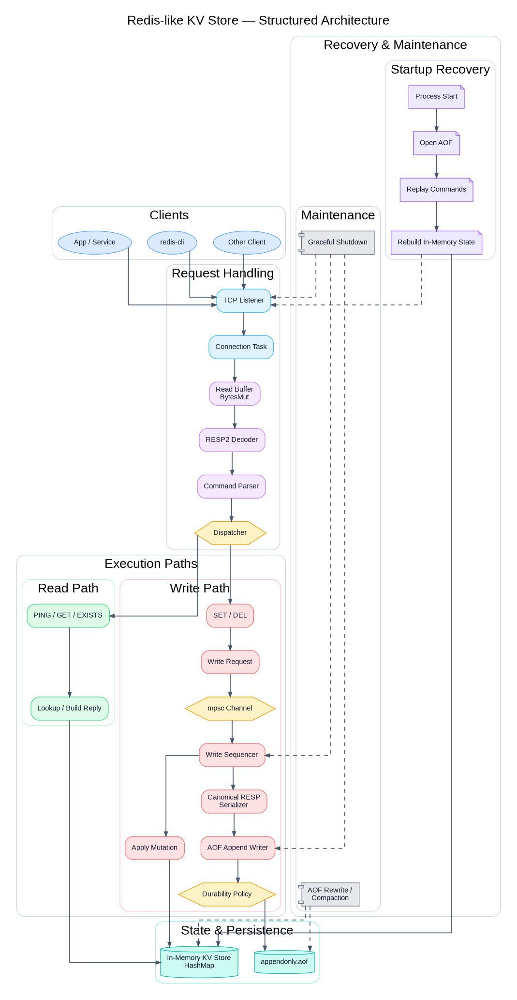

# kvred

`kvred` is a Redis-compatible string key-value server written in Rust with Tokio.

It speaks RESP2 over TCP, keeps hot state in memory, persists mutating commands to an append-only file (AOF), replays the AOF on startup, supports log compaction through AOF rewrite, and shuts down gracefully.

The project is intentionally scoped as a systems-learning implementation rather than a full Redis replacement. It focuses on protocol correctness, write ordering, recovery, and durability trade-offs.

## Scope

`kvred` implements a strict v1 contract:

- RESP2 only
- Binary-safe string keys and values
- Commands: `PING`, `GET`, `SET`, `DEL`, `EXISTS`
- In-memory serving state backed by `HashMap<Bytes, Bytes>`
- AOF persistence for mutating commands
- AOF replay on startup
- AOF rewrite / compaction
- Graceful shutdown with writer drain and final sync

Out of scope:

- TTL and expiration
- Eviction
- Transactions
- Replication
- Pub/Sub
- Lua scripting
- Clustering
- RESP3

## Architecture



The server is split into five main subsystems.

### 1. Protocol layer

The protocol layer parses and encodes RESP2 frames.

- `src/protocol/decode.rs`
- `src/protocol/encode.rs`
- `src/protocol/frame.rs`

It handles:

- partial reads
- multiple frames in a single buffer
- bulk strings and arrays
- binary-safe payloads

### 2. Command layer

The command layer converts decoded RESP arrays into typed commands and executes them against storage.

- `src/command/parse.rs`
- `src/command/exec.rs`

Command parsing is separated from protocol parsing on purpose:

- protocol parsing answers: "what bytes are on the wire?"
- command parsing answers: "what Redis command does this represent?"

### 3. In-memory state

The database state is an in-memory map shared across connections.

- `src/db/state.rs`
- `src/db/types.rs`

Reads operate directly on the shared map. Writes are sequenced through a single writer task.

### 4. Write sequencer

All mutating commands go through a single write path.

- `src/db/writer.rs`

The write sequencer:

1. receives write requests over a bounded Tokio `mpsc`
2. appends canonical RESP commands to the AOF
3. performs sync according to the configured fsync policy
4. applies the mutation to the in-memory map
5. returns the reply through a `oneshot`

This gives global write ordering and keeps durability logic out of connection tasks.

### 5. Persistence

Persistence is split into:

- `src/persistence/aof.rs` for append-only logging
- `src/persistence/replay.rs` for startup recovery
- `src/persistence/rewrite.rs` for compaction

Recovery reuses the same decode -> parse -> execute pipeline used by the live server.

## Request Flow

The live request path looks like this:

```text
TCP listener
  -> accept socket
  -> spawn connection task

Connection task
  -> read bytes into BytesMut
  -> decode RESP frame
  -> parse frame into Command
  -> execute:
       PING / GET / EXISTS -> read path
       SET / DEL           -> writer task
  -> encode reply
  -> write reply back to socket
```

The startup recovery path looks like this:

```text
Open AOF
  -> decode RESP frames from file
  -> parse into Command
  -> replay mutating commands into empty map
  -> start TCP listener
```

## Fsync Policies

The server supports three fsync policies through `KVRED_FSYNC`:

- `always`
- `everysec`
- `none`

### `KVRED_FSYNC=always`

Every mutating command is appended and `fsync`ed before it is acknowledged.

This is the strongest durability mode and the slowest write path.

### `KVRED_FSYNC=everysec`

Mutating commands are appended immediately and acknowledged without per-write `fsync`.

A background flusher syncs the AOF roughly once per second. This trades durability for throughput and can lose roughly the last second of acknowledged writes on crash.

### `KVRED_FSYNC=none`

Mutating commands are appended without periodic `fsync`.

This is the fastest mode and the weakest durability mode. Shutdown still performs a final flush and sync.

## Running

Build and run:

```bash
cargo run
```

Run with a specific fsync policy:

```bash
KVRED_FSYNC=always cargo run
KVRED_FSYNC=everysec cargo run
KVRED_FSYNC=none cargo run
```

The server listens on `127.0.0.1:6380`.

## Manual Usage

Using `redis-cli`:

```bash
redis-cli -p 6380 PING
redis-cli -p 6380 SET mykey hello
redis-cli -p 6380 GET mykey
redis-cli -p 6380 DEL mykey
redis-cli -p 6380 EXISTS mykey
```

Using raw RESP:

```bash
printf '*1\r\n$4\r\nPING\r\n' | nc 127.0.0.1 6380
printf '*3\r\n$3\r\nSET\r\n$5\r\nmykey\r\n$5\r\nhello\r\n' | nc 127.0.0.1 6380
printf '*2\r\n$3\r\nGET\r\n$5\r\nmykey\r\n' | nc 127.0.0.1 6380
```

## Testing

Run the full suite:

```bash
cargo test
```

The test suite covers:

- protocol roundtrips
- command parsing
- command execution
- AOF append behavior
- startup recovery
- rewrite / compaction
- TCP integration
- graceful shutdown

## Benchmarking

The repository includes a persistent-connection benchmark client:

- `bench_client.py`

Example usage:

```bash
python3 bench_client.py --mode ping -n 100000
python3 bench_client.py --mode get  -n 100000
python3 bench_client.py --mode exists -n 100000
python3 bench_client.py --mode set  -n 100000
python3 bench_client.py --mode del  -n 100000
```

To benchmark a specific fsync mode, start the server with that mode first:

```bash
KVRED_FSYNC=always ./target/release/kvred
KVRED_FSYNC=everysec ./target/release/kvred
KVRED_FSYNC=none ./target/release/kvred
```

Then run the benchmark client in another terminal.

For machine-readable output:

```bash
python3 bench_client.py --mode set -n 10000 --fsync always --format json
```

### Benchmark Reports

For a presentable report with one chart per fsync policy:

```bash
python3 bench_report.py --server-bin ./target/release/kvred
```

This generates a timestamped directory under `benchmark_reports/` containing:

- `charts/fsync-always.svg`
- `charts/fsync-everysec.svg`
- `charts/fsync-none.svg`
- `raw/results.json`
- `raw/results.csv`
- `raw/summary.json`
- `raw/summary.csv`
- `summary.md`

The report script is opinionated in ways that match the current codebase:

- it benchmarks reads and writes separately in the charts because reads bypass the writer task while writes go through AOF append and fsync
- it keeps one image per fsync mode so the durability policy is the variable being highlighted
- it runs warmups and repeated measurements, then charts median throughput with min/max whiskers
- it starts each fsync mode in its own working directory so each run gets an isolated `kvred.aof`
- it checkpoints partial results after each completed run, so `Ctrl-C` still leaves behind usable charts and raw data

Recommended invocation for a stable comparison:

```bash
python3 bench_report.py \
  --server-bin ./target/release/kvred \
  --repeats 5 \
  --warmup 1 \
  --ops-read 100000 \
  --ops-write 10000
```

Notes:

- the script prints progress and the report directory immediately
- `KVRED_FSYNC=always` can take several minutes with `--ops-write 10000` because every write and `DEL` prefill hits `fsync`
- if you want a faster first pass, start with `--ops-write 1000`

### Representative Results

Measured on the author’s machine over a single persistent TCP connection.

#### `KVRED_FSYNC=always`

| Command | Ops | Throughput | Avg latency |
|---|---:|---:|---:|
| `PING` | 10,000 | 61,410 ops/sec | 16.28 us |
| `GET`  | 10,000 | 87,514 ops/sec | 11.43 us |
| `SET`  | 10,000 | 742 ops/sec | 1346.09 us |
| `DEL`  | 10,000 | 699 ops/sec | 1430.76 us |

#### `KVRED_FSYNC=everysec`

| Command | Ops | Throughput | Avg latency |
|---|---:|---:|---:|
| `PING` | 100,000 | 98,178 ops/sec | 10.19 us |
| `GET`  | 100,000 | 83,065 ops/sec | 12.04 us |
| `SET`  | 100,000 | 18,875 ops/sec | 52.98 us |
| `DEL`  | 100,000 | 13,967 ops/sec | 71.60 us |

#### `KVRED_FSYNC=none`

| Command | Ops | Throughput | Avg latency |
|---|---:|---:|---:|
| `PING` | 100,000 | 110,988 ops/sec | 9.01 us |
| `GET`  | 100,000 | 92,359 ops/sec | 10.83 us |
| `SET`  | 100,000 | 26,181 ops/sec | 38.20 us |
| `DEL`  | 100,000 | 26,458 ops/sec | 37.80 us |

### Benchmark Notes

- Read-path performance is dominated by memory access and socket overhead.
- Write-path performance is dominated by the selected durability policy.
- In `always` mode, per-write `fsync` is the main bottleneck.
- The large gap between `always` and `everysec` / `none` is expected and validates the write-path design.

## Design Trade-offs

This server intentionally chooses correctness and clarity over maximum throughput.

Known bottlenecks:

- single write sequencer for all mutating commands
- synchronous durability barrier in `always` mode
- shared in-memory map protected by a mutex

These are acceptable trade-offs for the current scope and make the failure and recovery model easier to reason about.

## Current Status

`kvred` is a complete RESP2-compatible string KV server for the chosen scope:

- network server
- protocol framing
- typed command parsing
- in-memory execution
- append-only durability
- recovery
- rewrite / compaction
- graceful shutdown
- configurable fsync modes

It is not intended to compete with Redis in raw performance or feature coverage. It is intended to be a clean, understandable systems implementation of the core ideas behind a Redis-style server.
